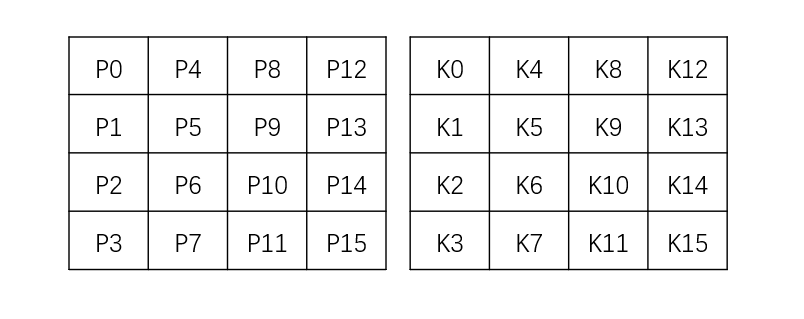
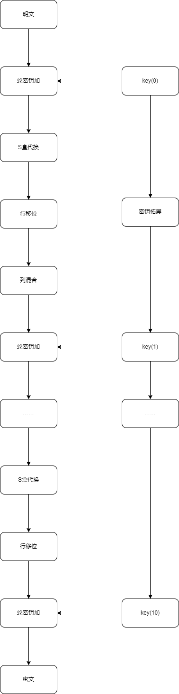
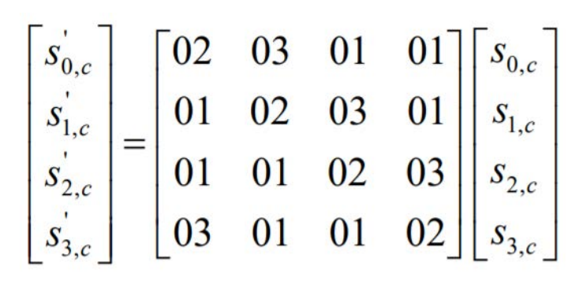
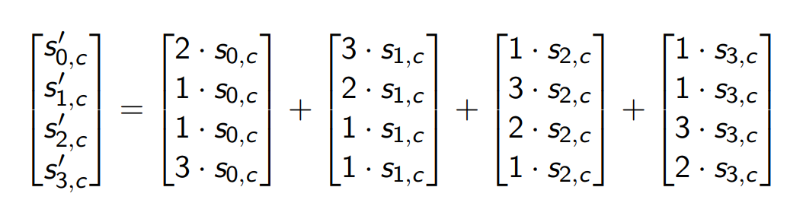

# 一、背景介绍

&emsp;&emsp;“AES – 高级加密标准（英语：Advanced Encryption Standard），在密码学中又称Rijndael加密法，是美国联邦政府采用的一种区块加密标准。这个标准用来替代原先的DES，已经被多方分析且广为全世界所使用。经过五年的甄选流程，高级加密标准由美国国家标准与技术研究院（NIST）于2001年11月26日发布于FIPS PUB 197，并在2002年5月26日成为有效的标准。2006年，高级加密标准已然成为对称密钥加密中最流行的算法之一。” — 摘抄于Wikipedia

<!--more-->

&emsp;&emsp;AES属于对称加密算法，是一种分组加密算法，由比利时的Joan Daemen和Vincent Rijmen设计。输入为n-bit的明文和k-bit的密钥。AES支持的分块的大小为n=128，三种密钥长度k=128,192,256。加解密使用相同的密钥。

&emsp;&emsp;通常来说，密钥长度越长，加密内容越难破解。

| AES     | 密钥长度(bit) | 分组长度(bit) | 加密轮数 |
| ------- | ------------- | ------------- | -------- |
| AES-128 | 128           | 128           | 10       |
| AES-129 | 192           | 128           | 12       |
| AES-256 | 256           | 128           | 14       |

&emsp;&emsp;在本文中使用C++实现AES-128一个分块的加密过程。

# 二、加密流程

## 1、流程及示意图

 &emsp;&emsp;首先将128-bit的明文和密钥分别按8-bit一组以列为主顺序转化为4*4的状态矩阵state和密钥矩阵key。



&emsp;&emsp;加密通过以下方式将明文转换为最终密文使用多个转换轮次更新状态。



## 2、流程各部分实现介绍

### 密钥异或

&emsp;&emsp;状态矩阵和密钥矩阵对应Bytes进行异或，更新状态矩阵state。

```c++
void aes::AddRoundKey()
{
	for (int i = 0; i < 4; i++)
	{
		state[i][0] = state[i][0] ^ key[i][0];
		state[i][1] = state[i][1] ^ key[i][1];
		state[i][2] = state[i][2] ^ key[i][2];
		state[i][3] = state[i][3] ^ key[i][3];
	}
}
```

### S盒代换

&emsp;&emsp;取状态矩阵中每个Bytes的前4-bit为行标，取后4-bit为列标，查阅S盒中对应的值进行相应的代换。

```c++
void aes::SubBytes()
{
	for (int i = 0; i < 4; i++)
	{
		for (int j = 0; j < 4; j++)
			state[i][j] = S_box[((state[i][j] & Bytes(0xf0)) >> 4).to_ulong()][(state[i][j] & Bytes(0x0f)).to_ulong()];
	}
}
```

### 行移位

&emsp;&emsp;每一行向左移动相应的Bytes数。

```c++
void aes::ShiftRow()
{
	for (int i = 0; i < 4; i++)
	{
		Bytes temp;
		for (int j = 0; j < i; j++)
		{
			temp = state[i][0];
			for (int k = 0; k <= 2; k++)
				state[i][k] = state[i][k + 1];
			state[i][3] = temp;
		}
	}
}
```

### 列混合

&emsp;&emsp;状态矩阵左乘一个常数矩阵Mix。

```c++
void aes::MixColumns()
{
    //状态矩阵左乘一个常数矩阵
	Bytes temp[4][4];
	for (int i = 0; i < 4; i++)
	{
		for (int j = 0; j < 4; j++)
		{
			for (int k = 0; k < 4; k++)
				temp[i][j] ^= GFmul(Mix[i][k], state[k][j]);
		}
	}
    //为状态矩阵赋值
	for (int i = 0; i < 4; i++)
	{
		for (int j = 0; j < 4; j++)
			state[i][j] = temp[i][j];
	}
}
```

### 密钥拓展算法

&emsp;&emsp;每一轮开始进行S盒的代换，然后取最后一列，将第一个Bytes放到最后，与常数矩阵rcon中该轮对应的常数逐Bytes进行异或，使用数组a暂存。之后逐行更新密钥矩阵，新的密钥矩阵的第一列由原密钥矩阵第一列和数组a异或，之后的第i列为原密钥矩阵第i列和新矩阵的第i-1列异或得到。

```c++
void aes::KeyExpansion(int n)
{
	Bytes a[4];
	a[0] = S_box[((key[1][3] & Bytes(0xf0)) >> 4).to_ulong()][(key[1][3] & Bytes(0x0f)).to_ulong()] ^ Bytes(rcon[n].to_string());
	a[1] = S_box[((key[2][3] & Bytes(0xf0)) >> 4).to_ulong()][(key[2][3] & Bytes(0x0f)).to_ulong()] ^ Bytes((rcon[n] << 8).to_string());
	a[2] = S_box[((key[3][3] & Bytes(0xf0)) >> 4).to_ulong()][(key[3][3] & Bytes(0x0f)).to_ulong()] ^ Bytes((rcon[n] << 16).to_string());
	a[3] = S_box[((key[0][3] & Bytes(0xf0)) >> 4).to_ulong()][(key[0][3] & Bytes(0x0f)).to_ulong()] ^ Bytes((rcon[n] << 24).to_string());
	for (int i = 0; i < 4; i++)
	{
		key[i][0] = key[i][0] ^ a[i];
		key[i][1] = key[i][0] ^ key[i][1];
		key[i][2] = key[i][1] ^ key[i][2];
		key[i][3] = key[i][2] ^ key[i][3];
	}
}
```

## 3、优化：列混合和S盒结合

&emsp;&emsp;通过观察可以发现每列左乘一个矩阵Mix，得到混合列的输出。列混合由这样的4个乘法实现。



由字节代换可以用S盒实现，由此可以想到是否可以通过查表的方法实现列混合，从而避免因计算产生的开销？答案是可以。由上图可知，$s ' _ {0,c}=2s _ {0,0}+3s _ {1,0}+s _ {2,0}+s _ {3,0}$。

&emsp;&emsp;直观的可以构造表：$(s_{0,c},s_{1,c},s_{2,c},s_{3,c})\rightarrow s_{j,c}(j\in\{0,1,2,3\})$。因此普通的查找表需要$2^{32}$*4个项，也就是需要16GB的空间。所以我们需要去找别的方法。

&emsp;&emsp;我们可以分别为2x和3x构造查找表。这样我们可以通过查表直接找到$2s_{0,0}$和$3s_{1,0}$，然后通过异或实现$\mathbb{F}_{2^8}$上的加法。只需要$2\times2^8$Bytes=0.5KB。状态矩阵一列需要8次内存访问和多次异或。**这对8-bit的处理器几乎是最好的解决方案了**。

&emsp;&emsp;但在32-bit的处理器上有着更好的处理办法。上图的计算可以拆解为如下形式：



我们可以建造一个查找表L：$\mathbb{F}_ {2^8}\rightarrow(\mathbb{F_ {2^8} },\mathbb{F_ {2^8} },\mathbb{F_ {2^8} },\mathbb{F_ {2^8} })$ ，例如：$L(x)=(2x,x,x,3x),x\in \mathbb {F^8_2}$。

因此 $(s' _ {0,c},s' _ {1,c},s' _ {2,c},s' _ {3,c})=L(s' _ {0,c})+L(s' _ {1,c})>>8+L(s' _ {2,c})>>16+L(s' _ {3,c})>>24$ （所有移位操作均为循环移位）。需$4 \times 2^8$Bytes=1KB。状态矩阵一列需要4次内存访问和较少的异或。

&emsp;&emsp;因为先行移位再S盒代换和先S盒代换再行移位的结果是一样的，所以我们可以构造查找表$L(x)=(2S(x),S(x),S(x),3S(x)),x\in\mathbb{F^8_2}$。因此我们将S盒代换盒列混合放到了一起。

- 生成L表。该步应在预处理阶段完成。

```c++
void aes::newL()
{
	for (int i = 0; i < 16; i++)
		for (int j = 0; j < 16; j++)
		{
			L[i][j] = Word(GFmul(0x02, S_box[i][j]).to_string() + S_box[i][j].to_string() + S_box[i][j].to_string() + GFmul(0x03, S_box[i][j]).to_string());
		}
}
```

- 通过查表实现S盒代换和列混合。

```c++
void aes::impMix()
{
	Word temp[4];
	for (int i = 0; i < 4; i++)
	{
		temp[i] = (L[((state[0][i] & Bytes(0xf0)) >> 4).to_ulong()][(state[0][i] & Bytes(0x0f)).to_ulong()])^ rightshift(L[((state[1][i] & Bytes(0xf0)) >> 4).to_ulong()][(state[1][i] & Bytes(0x0f)).to_ulong()],1)^ rightshift(L[((state[2][i] & Bytes(0xf0)) >> 4).to_ulong()][(state[2][i] & Bytes(0x0f)).to_ulong()], 2)^ rightshift(L[((state[3][i] & Bytes(0xf0)) >> 4).to_ulong()][(state[3][i] & Bytes(0x0f)).to_ulong()], 3);
	}
	//将每个Word划分为4Bytes作为状态矩阵的对应列。
	for (int i = 0; i < 4; i++)
	{
		state[0][i] = Bytes((temp[i].to_string()).substr(0, 8));
		state[1][i] = Bytes((temp[i].to_string()).substr(8, 8));
		state[2][i] = Bytes((temp[i].to_string()).substr(16, 8));
		state[3][i] = Bytes((temp[i].to_string()).substr(24, 8));
	}
}
```

# 三、代码补充说明

- 使用bitset定义8-bit长的数据类型Bytes，和32-bit的数据类型Word。

```c++
typedef std::bitset<8> Bytes;
typedef std::bitset<32> Word;
```

- 对Word类型实现循环右移，每次进行8-bit的循环移位，x代表需要进行几次。例：循环移位24位即3次8位的移动。

```c++
Word aes::rightshift(Word s,int x)
{
	for (int i = 0; i < x;i++)
	{
		Word temp = s & Word(0x000000ff);
		s = (s >> 8) ^ (temp << 24);
	}
	return s;
}
```

- 有限域上的乘法：b乘01结果仍为b；b乘02，b的最高位即b[7]=0，结果为b<<1，b的最高位为1，结果为(b<<1)$\bigoplus$0x1b；b乘03，根据乘法结合律可知，结果为b$\bigoplus$(b*02)。

```c++
Bytes aes::GFmul(Bytes a, Bytes b)
{
	if (a == 0x02)
	{
		if (b[7] == 1)
		{
			b = (b << 1);
			b = b ^= 0x1b;
		}
		else if (b[7] == 0)
			b = (b << 1);
	}
	if (a == 0x03)
		b = (b ^ GFmul(0x02, b));
	return b;
}
```

- 列混合所需要的常数矩阵。

```c++
Bytes Mix[4][4] = {
	{0x02,0x03,0x01,0x01},
	{0x01,0x02,0x03,0x01},
	{0x01,0x01,0x02,0x03},
	{0x03,0x01,0x01,0x02}
	};
```

- S盒。

```c++
Bytes S_box[16][16] = {
	{0x63,0x7c,0x77,0x7b,0xf2,0x6b,0x6f,0xc5,0x30,0x01,0x67,0x2b,0xfe,0xd7,0xab,0x76},
	{0xca,0x82,0xc9,0x7d,0xfa,0x59,0x47,0xf0,0xad,0xd4,0xa2,0xaf,0x9c,0xa4,0x72,0xc0},
	{0xb7,0xfd,0x93,0x26,0x36,0x3f,0xf7,0xcc,0x34,0xa5,0xe5,0xf1,0x71,0xd8,0x31,0x15},
	{0x04,0xc7,0x23,0xc3,0x18,0x96,0x05,0x9a,0x07,0x12,0x80,0xe2,0xeb,0x27,0xb2,0x75},
	{0x09,0x83,0x2c,0x1a,0x1b,0x6e,0x5a,0xa0,0x52,0x3b,0xd6,0xb3,0x29,0xe3,0x2f,0x84},
	{0x53,0xd1,0x00,0xed,0x20,0xfc,0xb1,0x5b,0x6a,0xcb,0xbe,0x39,0x4a,0x4c,0x58,0xcf},
	{0xd0,0xef,0xaa,0xfb,0x43,0x4d,0x33,0x85,0x45,0xf9,0x02,0x7f,0x50,0x3c,0x9f,0xa8},
	{0x51,0xa3,0x40,0x8f,0x92,0x9d,0x38,0xf5,0xbc,0xb6,0xda,0x21,0x10,0xff,0xf3,0xd2},
	{0xcd,0x0c,0x13,0xec,0x5f,0x97,0x44,0x17,0xc4,0xa7,0x7e,0x3d,0x64,0x5d,0x19,0x73},
	{0x60,0x81,0x4f,0xdc,0x22,0x2a,0x90,0x88,0x46,0xee,0xb8,0x14,0xde,0x5e,0x0b,0xdb},
	{0xe0,0x32,0x3a,0x0a,0x49,0x06,0x24,0x5c,0xc2,0xd3,0xac,0x62,0x91,0x95,0xe4,0x79},
	{0xe7,0xc8,0x37,0x6d,0x8d,0xd5,0x4e,0xa9,0x6c,0x56,0xf4,0xea,0x65,0x7a,0xae,0x08},
	{0xba,0x78,0x25,0x2e,0x1c,0xa6,0xb4,0xc6,0xe8,0xdd,0x74,0x1f,0x4b,0xbd,0x8b,0x8a},
	{0x70,0x3e,0xb5,0x66,0x48,0x03,0xf6,0x0e,0x61,0x35,0x57,0xb9,0x86,0xc1,0x1d,0x9e},
	{0xe1,0xf8,0x98,0x11,0x69,0xd9,0x8e,0x94,0x9b,0x1e,0x87,0xe9,0xce,0x55,0x28,0xdf},
	{0x8c,0xa1,0x89,0x0d,0xbf,0xe6,0x42,0x68,0x41,0x99,0x2d,0x0f,0xb0,0x54,0xbb,0x16}
};
```

- 生成轮密钥所使用的常数矩阵。

```c++
Word rcon[10] = { 0x01000000, 0x02000000, 0x04000000, 0x08000000,
	0x10000000,0x20000000, 0x40000000, 0x80000000, 0x1b000000, 0x36000000 };
```

# 四、完整代码

## aes.h

```c++
#include <bitset>
#include <string>

typedef std::bitset<8> Bytes;
typedef std::bitset<32> Word;

//aes类
class aes
{
public:
	//密文矩阵
	Bytes ct[4][4];
	//密钥矩阵
	Bytes key[4][4] = { {0x2b,0x28,0xab,0x09},{0x7e,0xae,0xf7,0xcf},
		{0x15,0xd2,0x15,0x4f},{0x16,0xa6,0x88,0x3c} };
	void encrypt();
private:
	//明文状态矩阵
	Bytes state[4][4] = { {0x32,0x88,0x31,0xe0},{0x43,0x5a,0x31,0x37},
	{0xf6,0x30,0x98,0x07},{0xa8,0x8d,0xa2,0x34} };
	//拓展后的轮密钥
	//L盒
	Word L[16][16];
	//S盒
	Bytes S_box[16][16] = {
	{0x63,0x7c,0x77,0x7b,0xf2,0x6b,0x6f,0xc5,0x30,0x01,0x67,0x2b,0xfe,0xd7,0xab,0x76},
	{0xca,0x82,0xc9,0x7d,0xfa,0x59,0x47,0xf0,0xad,0xd4,0xa2,0xaf,0x9c,0xa4,0x72,0xc0},
	{0xb7,0xfd,0x93,0x26,0x36,0x3f,0xf7,0xcc,0x34,0xa5,0xe5,0xf1,0x71,0xd8,0x31,0x15},
	{0x04,0xc7,0x23,0xc3,0x18,0x96,0x05,0x9a,0x07,0x12,0x80,0xe2,0xeb,0x27,0xb2,0x75},
	{0x09,0x83,0x2c,0x1a,0x1b,0x6e,0x5a,0xa0,0x52,0x3b,0xd6,0xb3,0x29,0xe3,0x2f,0x84},
	{0x53,0xd1,0x00,0xed,0x20,0xfc,0xb1,0x5b,0x6a,0xcb,0xbe,0x39,0x4a,0x4c,0x58,0xcf},
	{0xd0,0xef,0xaa,0xfb,0x43,0x4d,0x33,0x85,0x45,0xf9,0x02,0x7f,0x50,0x3c,0x9f,0xa8},
	{0x51,0xa3,0x40,0x8f,0x92,0x9d,0x38,0xf5,0xbc,0xb6,0xda,0x21,0x10,0xff,0xf3,0xd2},
	{0xcd,0x0c,0x13,0xec,0x5f,0x97,0x44,0x17,0xc4,0xa7,0x7e,0x3d,0x64,0x5d,0x19,0x73},
	{0x60,0x81,0x4f,0xdc,0x22,0x2a,0x90,0x88,0x46,0xee,0xb8,0x14,0xde,0x5e,0x0b,0xdb},
	{0xe0,0x32,0x3a,0x0a,0x49,0x06,0x24,0x5c,0xc2,0xd3,0xac,0x62,0x91,0x95,0xe4,0x79},
	{0xe7,0xc8,0x37,0x6d,0x8d,0xd5,0x4e,0xa9,0x6c,0x56,0xf4,0xea,0x65,0x7a,0xae,0x08},
	{0xba,0x78,0x25,0x2e,0x1c,0xa6,0xb4,0xc6,0xe8,0xdd,0x74,0x1f,0x4b,0xbd,0x8b,0x8a},
	{0x70,0x3e,0xb5,0x66,0x48,0x03,0xf6,0x0e,0x61,0x35,0x57,0xb9,0x86,0xc1,0x1d,0x9e},
	{0xe1,0xf8,0x98,0x11,0x69,0xd9,0x8e,0x94,0x9b,0x1e,0x87,0xe9,0xce,0x55,0x28,0xdf},
	{0x8c,0xa1,0x89,0x0d,0xbf,0xe6,0x42,0x68,0x41,0x99,0x2d,0x0f,0xb0,0x54,0xbb,0x16}
};
	//列混合所需的矩阵
	Bytes Mix[4][4] = {
	{0x02,0x03,0x01,0x01},
	{0x01,0x02,0x03,0x01},
	{0x01,0x01,0x02,0x03},
	{0x03,0x01,0x01,0x02}
	};
	//轮密钥生成所需要的常数
	Word rcon[10] = { 0x01000000, 0x02000000, 0x04000000, 0x08000000,
	0x10000000,0x20000000, 0x40000000, 0x80000000, 0x1b000000, 0x36000000 };
	//生成密文矩阵
	void trans();
	//异或轮密钥
	void AddRoundKey();
	//过S盒
	void SubBytes();
	//行变换
	void ShiftRow();
	//有限域上的乘法
	Bytes GFmul(Bytes a, Bytes b);
	//列混合
	void MixColumns();
	//密钥拓展
	void KeyExpansion(int n);
	//循环移位
	Word rightshift(Word s,int x);
	//预处理产生S盒交换和列混合结合的表
	void newL();
	//列混合的改进
	void impMix();
};

void aes::encrypt()
{
	newL();
	//加密过程
	AddRoundKey();
	//前9次循环
	for (int k = 0; k < 9; k++)
	{
		KeyExpansion(k);
		//SubBytes();
		ShiftRow();
		//MixColumns();
		impMix();
		AddRoundKey();
	}
	//最后一次循环
	KeyExpansion(9);
	SubBytes();
	ShiftRow();
	AddRoundKey();
	trans();
}

void aes::AddRoundKey()
{
	for (int i = 0; i < 4; i++)
	{
		state[i][0] = state[i][0] ^ key[i][0];
		state[i][1] = state[i][1] ^ key[i][1];
		state[i][2] = state[i][2] ^ key[i][2];
		state[i][3] = state[i][3] ^ key[i][3];
	}
}

void aes::SubBytes()
{
	for (int i = 0; i < 4; i++)
	{
		for (int j = 0; j < 4; j++)
			state[i][j] = S_box[((state[i][j] & Bytes(0xf0)) >> 4).to_ulong()][(state[i][j] & Bytes(0x0f)).to_ulong()];
	}
}

void aes::ShiftRow()
{
	for (int i = 0; i < 4; i++)
	{
		Bytes temp;
		for (int j = 0; j < i; j++)
		{
			temp = state[i][0];
			for (int k = 0; k <= 2; k++)
				state[i][k] = state[i][k + 1];
			state[i][3] = temp;
		}
	}
}

Bytes aes::GFmul(Bytes a, Bytes b)
{
	if (a == 0x02)
	{
		if (b[7] == 1)
		{
			b = (b << 1);
			b = b ^= 0x1b;
		}
		else if (b[7] == 0)
			b = (b << 1);
	}
	if (a == 0x03)
		b = (b ^ GFmul(0x02, b));
	return b;
}

void aes::MixColumns()
{
	Bytes temp[4][4];
	for (int i = 0; i < 4; i++)
	{
		for (int j = 0; j < 4; j++)
		{
			for (int k = 0; k < 4; k++)
				temp[i][j] ^= GFmul(Mix[i][k], state[k][j]);
		}
	}
	for (int i = 0; i < 4; i++)
	{
		for (int j = 0; j < 4; j++)
			state[i][j] = temp[i][j];
	}
}
 
void aes::KeyExpansion(int n)
{
	Bytes a[4];
	a[0] = S_box[((key[1][3] & Bytes(0xf0)) >> 4).to_ulong()][(key[1][3] & Bytes(0x0f)).to_ulong()] ^ Bytes(rcon[n].to_string());
	a[1] = S_box[((key[2][3] & Bytes(0xf0)) >> 4).to_ulong()][(key[2][3] & Bytes(0x0f)).to_ulong()] ^ Bytes((rcon[n] << 8).to_string());
	a[2] = S_box[((key[3][3] & Bytes(0xf0)) >> 4).to_ulong()][(key[3][3] & Bytes(0x0f)).to_ulong()] ^ Bytes((rcon[n] << 16).to_string());
	a[3] = S_box[((key[0][3] & Bytes(0xf0)) >> 4).to_ulong()][(key[0][3] & Bytes(0x0f)).to_ulong()] ^ Bytes((rcon[n] << 24).to_string());
	for (int i = 0; i < 4; i++)
	{
		key[i][0] = key[i][0] ^ a[i];
		key[i][1] = key[i][0] ^ key[i][1];
		key[i][2] = key[i][1] ^ key[i][2];
		key[i][3] = key[i][2] ^ key[i][3];
	}
}

void aes::trans()
{
	for (int i = 0; i < 4; i++)
		for (int j = 0; j < 4; j++)
			ct[i][j] = state[i][j];

}

void aes::newL()
{
	for (int i = 0; i < 16; i++)
		for (int j = 0; j < 16; j++)
		{
			L[i][j] = Word(GFmul(0x02, S_box[i][j]).to_string() + S_box[i][j].to_string() + S_box[i][j].to_string() + GFmul(0x03, S_box[i][j]).to_string());
		}
}

Word aes::rightshift(Word s,int x)
{
	for (int i = 0; i < x;i++)
	{
		Word temp = s & Word(0x000000ff);
		s = (s >> 8) ^ (temp << 24);
	}
	return s;
}

void aes::impMix()
{
	Word temp[4];
	for (int i = 0; i < 4; i++)
	{
		temp[i] = (L[((state[0][i] & Bytes(0xf0)) >> 4).to_ulong()][(state[0][i] & Bytes(0x0f)).to_ulong()])^ rightshift(L[((state[1][i] & Bytes(0xf0)) >> 4).to_ulong()][(state[1][i] & Bytes(0x0f)).to_ulong()],1)^ rightshift(L[((state[2][i] & Bytes(0xf0)) >> 4).to_ulong()][(state[2][i] & Bytes(0x0f)).to_ulong()], 2)^ rightshift(L[((state[3][i] & Bytes(0xf0)) >> 4).to_ulong()][(state[3][i] & Bytes(0x0f)).to_ulong()], 3);
	}
	//将每个Word划分为4Bytes作为状态矩阵的对应列。
	for (int i = 0; i < 4; i++)
	{
		state[0][i] = Bytes((temp[i].to_string()).substr(0, 8));
		state[1][i] = Bytes((temp[i].to_string()).substr(8, 8));
		state[2][i] = Bytes((temp[i].to_string()).substr(16, 8));
		state[3][i] = Bytes((temp[i].to_string()).substr(24, 8));
	}
}
```

## AES.cpp

```c++
#include "aes.h"
#include <iostream>
#include <iomanip>
using namespace std;
int main()
{
	aes AES;
	AES.encrypt();
	cout << "密文为：";
	//输出密文
	for (int j = 0; j < 4; j++)
	{
		for (int i = 0; i < 4; i++)
		{
			cout << "0x" << setw(2) << setfill('0') << hex << Bytes(AES.ct[i][j].to_ulong()).to_ulong() << " ";
		}
	}
	return 0;
}
```


